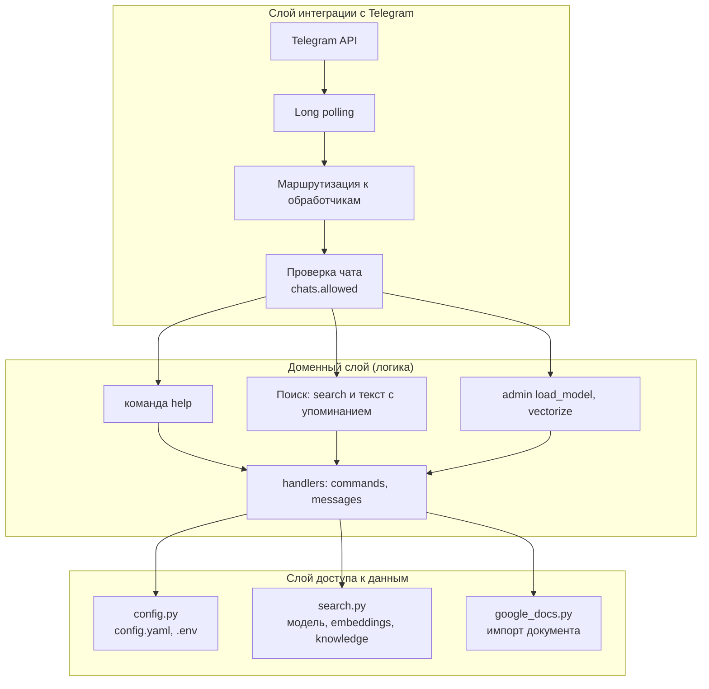
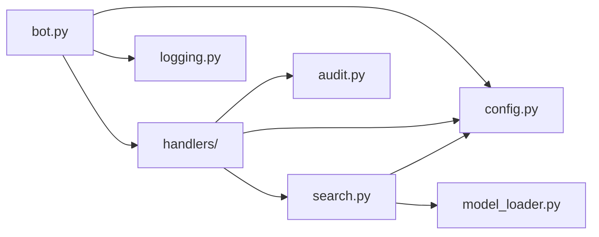

# Архитектура компонентов (три слоя)

Соответствует `docs/vision.md`: Telegram-адаптер → доменная логика → доступ к данным.

## Три слоя

```mermaid
flowchart TB
    subgraph Telegram["Слой интеграции с Telegram"]
        API[Telegram API]
        Polling[Long polling]
        Route[Маршрутизация к обработчикам]
        Whitelist[Проверка чата<br/>chats.allowed]
    end

    subgraph Domain["Доменный слой (логика)"]
        Help[команда help]
        Search[Поиск: search и текст с упоминанием]
        Admin[admin load_model, vectorize]
        Handlers[handlers: commands, messages]
    end

    subgraph Data["Слой доступа к данным"]
        Config[config.py<br/>config.yaml, .env]
        SearchModule[search.py<br/>модель, embeddings, knowledge]
        GoogleDocs[google_docs.py<br/>импорт документа]
    end

    API --> Polling
    Polling --> Route
    Route --> Whitelist
    Whitelist --> Help
    Whitelist --> Search
    Whitelist --> Admin
    Help --> Handlers
    Search --> Handlers
    Admin --> Handlers
    Handlers --> Config
    Handlers --> SearchModule
    Handlers --> GoogleDocs
```

## Зависимости модулей

```mermaid
flowchart LR
    bot[bot.py] --> handlers[handlers/]
    bot --> config[config.py]
    bot --> logging[logging.py]
    handlers --> config
    handlers --> search[search.py]
    handlers --> audit[audit.py]
    search --> config
    search --> model_loader[model_loader.py]
```
