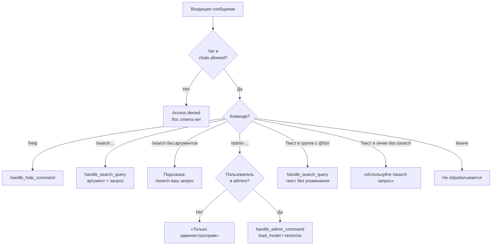

# Маршрутизация команд

Как входящее сообщение попадает к нужному обработчику (bot.py, handlers).

## Выбор обработчика

## Порядок регистрации обработчиков (bot.py)

1. `CommandHandler("help", ...)` — /help  
2. `CommandHandler("admin", ...)` — /admin (после проверки admins)  
3. `MessageHandler(TEXT & GROUPS & Mention(bot))` — текст с упоминанием бота в группе  
4. `CommandHandler("search", ...)` — /search запрос (или подсказка, если запрос пустой)
