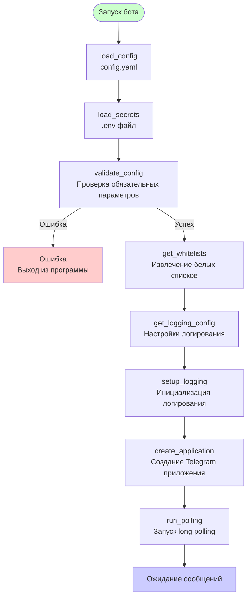
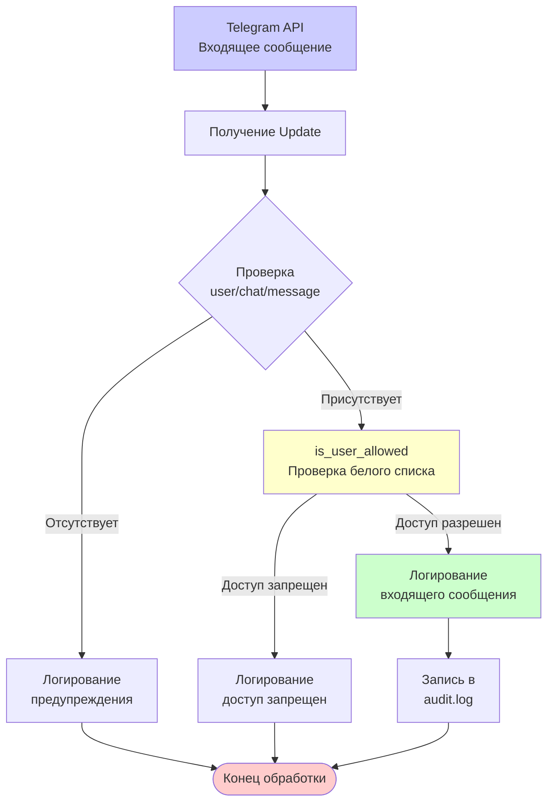
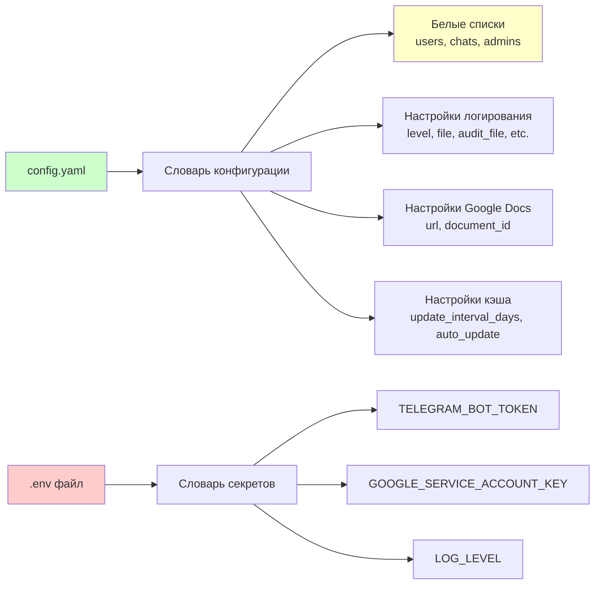
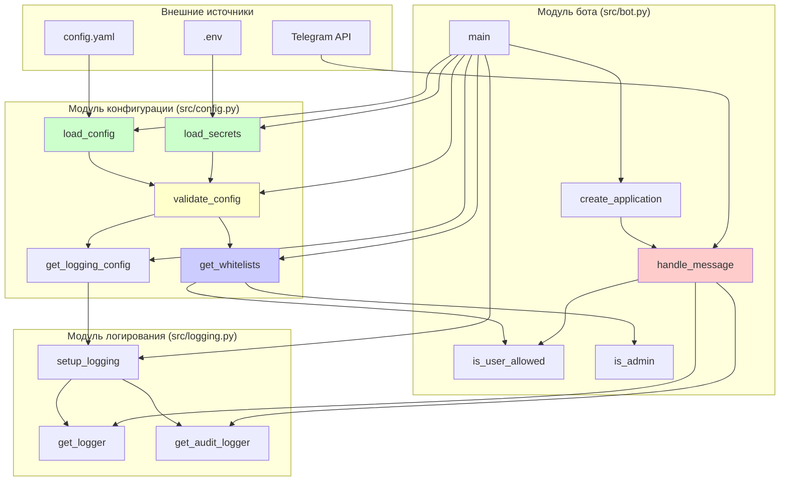
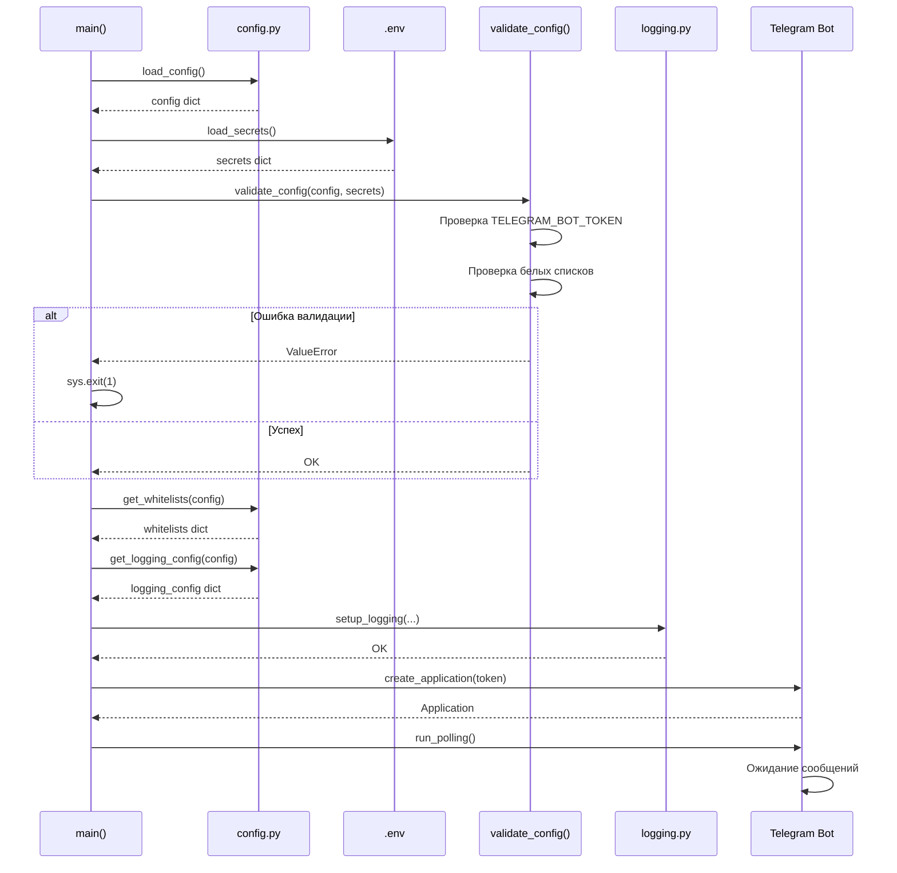
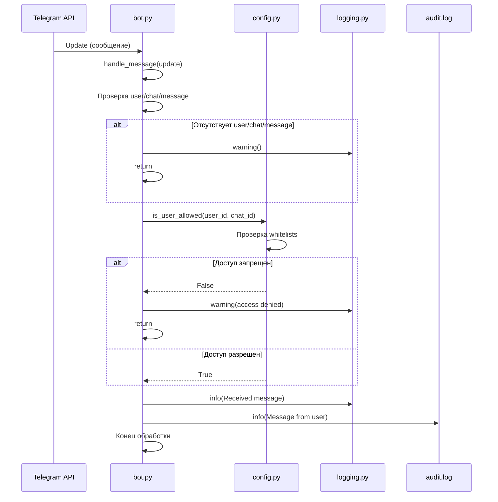

# Диаграмма потоков данных - Итерация 3

Диаграмма показывает потоки данных в системе на этапе итерации 3 (модуль конфигурации).

## Поток данных при запуске бота

## Поток данных при обработке сообщения

## Структура данных конфигурации

## Компоненты системы

## Последовательность операций при старте

## Последовательность обработки сообщения

