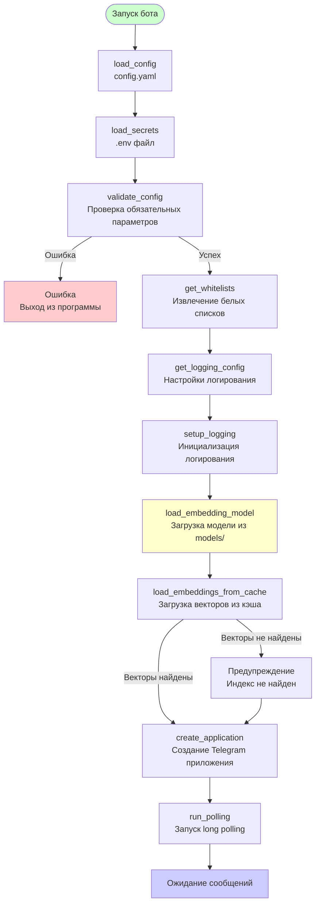
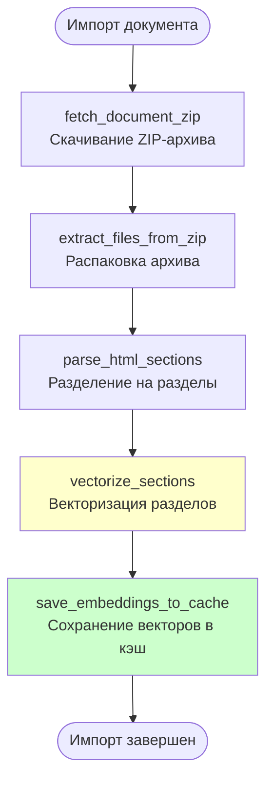
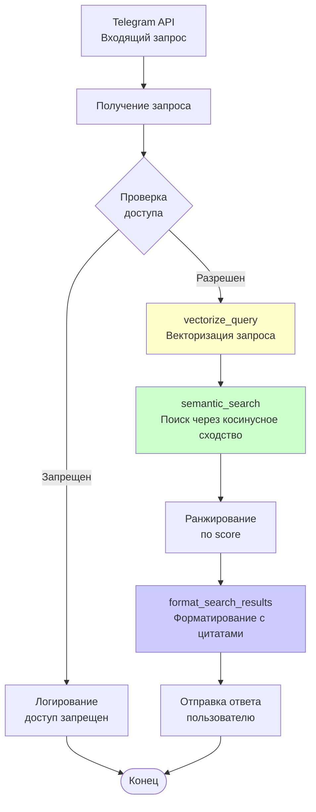
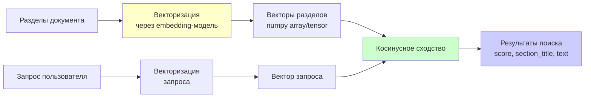
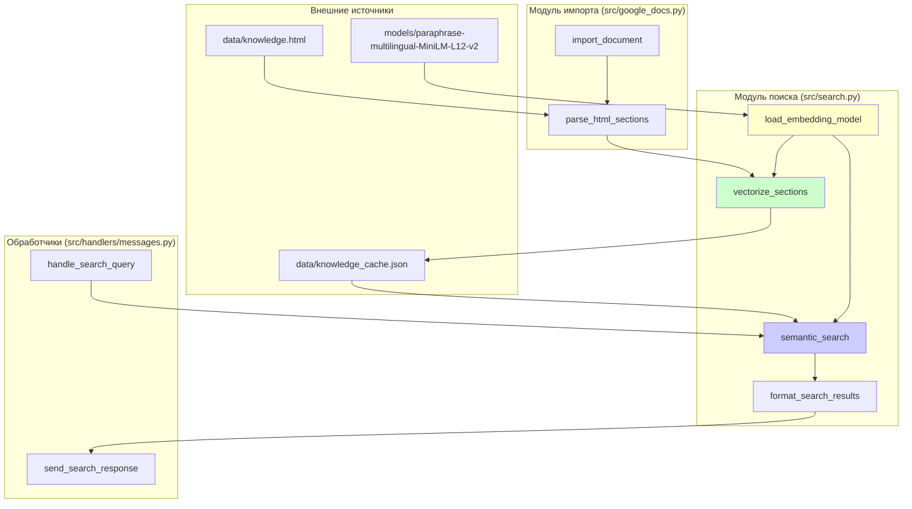
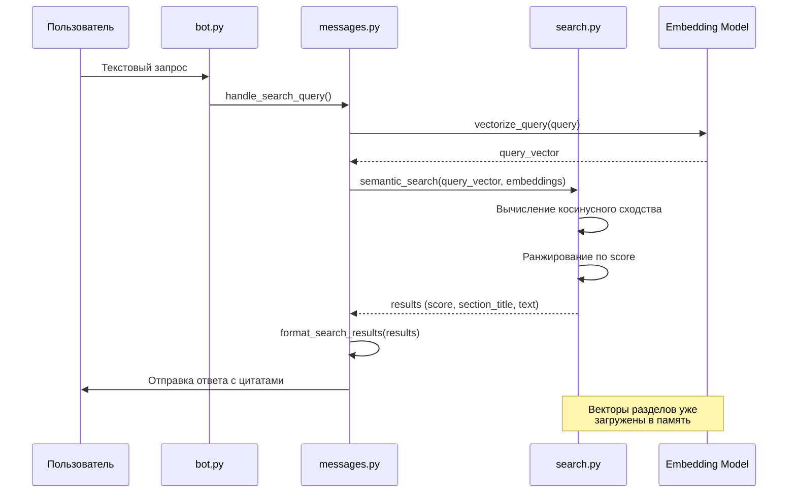
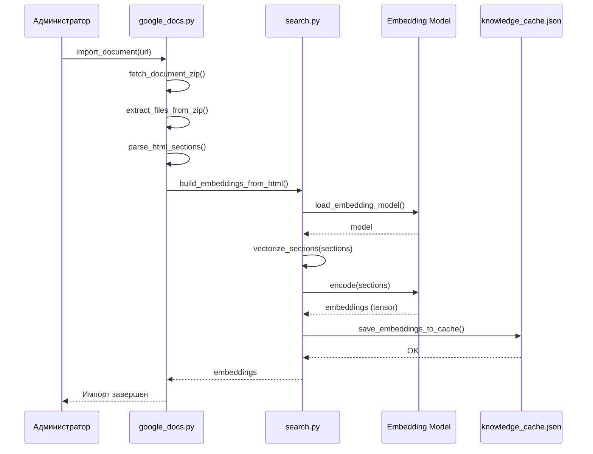

# Диаграмма потоков данных - Семантический поиск

Диаграмма показывает потоки данных в системе с использованием семантического поиска через embedding-модели.

## Поток данных при запуске бота

## Поток данных при импорте документа

## Поток данных при поиске

## Структура данных поиска

## Компоненты системы поиска

## Последовательность операций при поиске

## Последовательность операций при импорте

