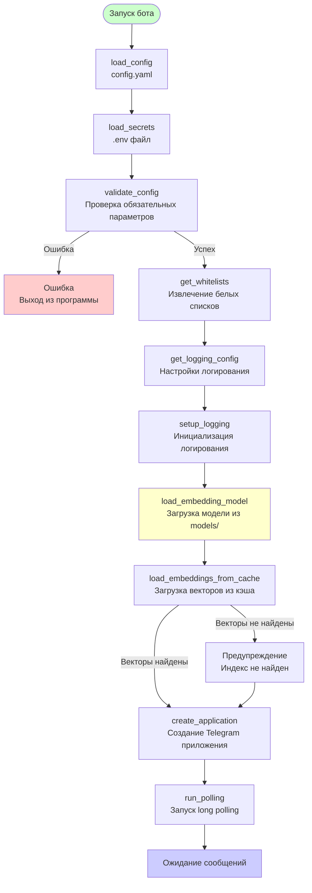
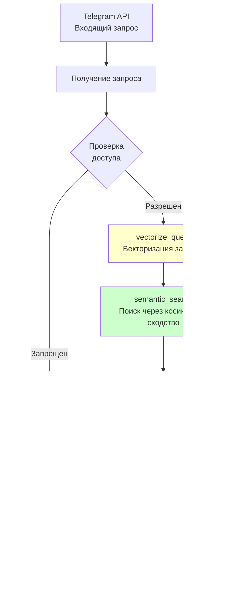
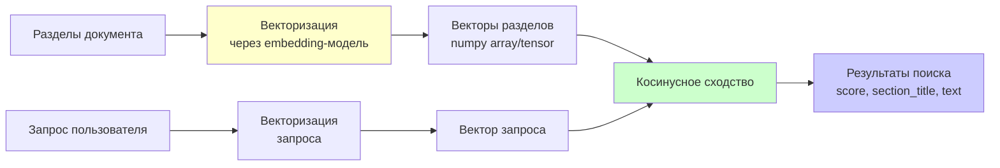
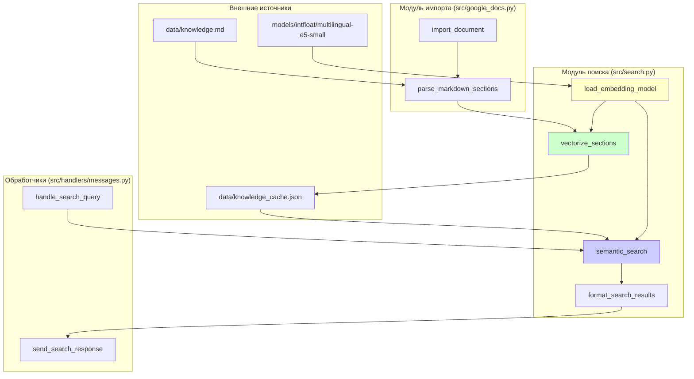
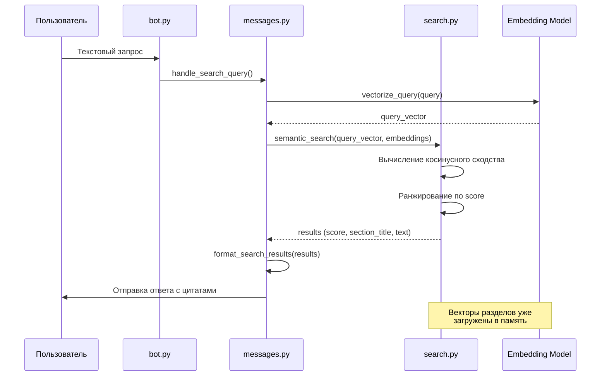

# Диаграмма потоков данных - Семантический поиск

Диаграмма показывает потоки данных в системе с использованием семантического поиска через embedding-модели.

**Ревью (итерация 15):** Схемы актуальны. Уточнения: используется **Markdown** (`data/knowledge.md`, `parse_markdown_sections`, `build_embeddings_from_markdown`); модель — `intfloat/multilingual-e5-small`. Импорт документа выполняется **отдельным скриптом** вне бота (не командой бота).

## Поток данных при запуске бота

```mermaid
flowchart TD
    Start([Запуск бота]) --> LoadConfig[load_config<br/>config.yaml]
    LoadConfig --> LoadSecrets[load_secrets<br/>.env файл]
    LoadSecrets --> Validate[validate_config<br/>Проверка обязательных параметров]
    
    Validate -->|Ошибка| ErrorExit[Ошибка<br/>Выход из программы]
    Validate -->|Успех| GetWhitelists[get_whitelists<br/>Извлечение белых списков]
    
    GetWhitelists --> GetLoggingConfig[get_logging_config<br/>Настройки логирования]
    GetLoggingConfig --> SetupLogging[setup_logging<br/>Инициализация логирования]
    
    SetupLogging --> LoadModel[load_embedding_model<br/>Загрузка модели из models/]
    LoadModel --> LoadIndex[load_embeddings_from_cache<br/>Загрузка векторов из кэша]
    
    LoadIndex -->|Векторы найдены| CreateApp[create_application<br/>Создание Telegram приложения]
    LoadIndex -->|Векторы не найдены| WarnNoIndex[Предупреждение<br/>Индекс не найден]
    WarnNoIndex --> CreateApp
    
    CreateApp --> RunPolling[run_polling<br/>Запуск long polling]
    RunPolling --> WaitMessages[Ожидание сообщений]
    
    style ErrorExit fill:#ffcccc
    style Start fill:#ccffcc
    style LoadModel fill:#ffffcc
    style WaitMessages fill:#ccccff
```

## Поток данных при поиске

```mermaid
flowchart TD
    TelegramAPI[Telegram API<br/>Входящий запрос] --> ReceiveQuery[Получение запроса]
    
    ReceiveQuery --> CheckAccess{Проверка<br/>доступа}
    CheckAccess -->|Запрещен| LogDenied[Логирование<br/>доступ запрещен]
    CheckAccess -->|Разрешен| VectorizeQuery[vectorize_query<br/>Векторизация запроса]
    
    VectorizeQuery --> SemanticSearch[semantic_search<br/>Поиск через косинусное сходство]
    SemanticSearch --> RankResults[Ранжирование<br/>по score]
    
    RankResults --> FormatResults[format_search_results<br/>Форматирование с цитатами]
    FormatResults --> SendResponse[Отправка ответа<br/>пользователю]
    
    LogDenied --> End([Конец])
    SendResponse --> End
    
    style VectorizeQuery fill:#ffffcc
    style SemanticSearch fill:#ccffcc
    style FormatResults fill:#ccccff
```

## Структура данных поиска

```mermaid
flowchart LR
    Sections[Разделы документа] --> Vectorize[Векторизация<br/>через embedding-модель]
    Vectorize --> Embeddings[Векторы разделов<br/>numpy array/tensor]
    
    Query[Запрос пользователя] --> VectorizeQuery[Векторизация<br/>запроса]
    VectorizeQuery --> QueryVector[Вектор запроса]
    
    Embeddings --> CosineSim[Косинусное сходство]
    QueryVector --> CosineSim
    
    CosineSim --> Results[Результаты поиска<br/>score, section_title, text]
    
    style Vectorize fill:#ffffcc
    style CosineSim fill:#ccffcc
    style Results fill:#ccccff
```

## Компоненты системы поиска

```mermaid
graph TB
    subgraph "Модуль поиска (src/search.py)"
        LoadModel[load_embedding_model]
        VectorizeSections[vectorize_sections]
        SemanticSearch[semantic_search]
        FormatResults[format_search_results]
    end
    
    subgraph "Модуль импорта (src/google_docs.py)"
        ImportDoc[import_document]
        ParseSections[parse_markdown_sections]
    end
    
    subgraph "Обработчики (src/handlers/messages.py)"
        HandleQuery[handle_search_query]
        SendResponse[send_search_response]
    end
    
    subgraph "Внешние источники"
        ModelFile[models/intfloat/multilingual-e5-small]
        CacheFile[data/knowledge_cache.json]
        MDFile[data/knowledge.md]
    end
    
    ModelFile --> LoadModel
    MDFile --> ParseSections
    ParseSections --> VectorizeSections
    VectorizeSections --> CacheFile
    
    CacheFile --> SemanticSearch
    LoadModel --> VectorizeSections
    LoadModel --> SemanticSearch
    
    HandleQuery --> SemanticSearch
    SemanticSearch --> FormatResults
    FormatResults --> SendResponse
    
    ImportDoc --> ParseSections
    
    style LoadModel fill:#ffffcc
    style VectorizeSections fill:#ccffcc
    style SemanticSearch fill:#ccccff
```

## Последовательность операций при поиске

```mermaid
sequenceDiagram
    participant User as Пользователь
    participant Bot as bot.py
    participant Handler as messages.py
    participant Search as search.py
    participant Model as Embedding Model
    
    User->>Bot: Текстовый запрос
    Bot->>Handler: handle_search_query()
    
    Handler->>Model: vectorize_query(query)
    Model-->>Handler: query_vector
    
    Handler->>Search: semantic_search(query_vector, embeddings)
    Search->>Search: Вычисление косинусного сходства
    Search->>Search: Ранжирование по score
    Search-->>Handler: results (score, section_title, text)
    
    Handler->>Handler: format_search_results(results)
    Handler->>User: Отправка ответа с цитатами
    
    Note over Search,Model: Векторы разделов уже<br/>загружены в память
```

