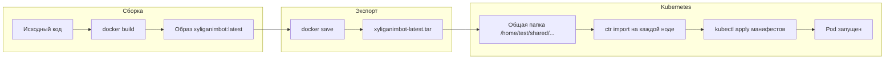
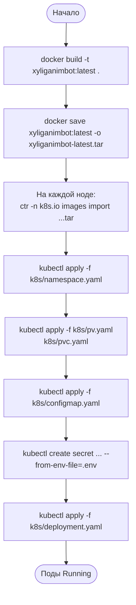
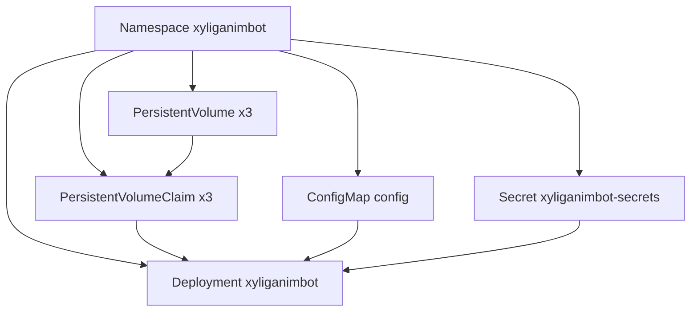

# Развертывание: Docker и Kubernetes

Цепочка от сборки образа до запуска в кластере (containerd, общая папка).

## Общая схема

```mermaid
flowchart LR
    subgraph Build["Сборка"]
        A[Исходный код] --> B[docker build]
        B --> C[Образ xyliganimbot:latest]
    end
    subgraph Export["Экспорт"]
        C --> D[docker save]
        D --> E[xyliganimbot-latest.tar]
    end
    subgraph K8s["Kubernetes"]
        E --> F[Общая папка /home/test/shared/...]
        F --> G[ctr import на каждой ноде]
        G --> H[kubectl apply манифестов]
        H --> I[Pod запущен]
    end
```

## Шаги развертывания (Kubernetes)

```mermaid
flowchart TD
    Start([Начало]) --> Build[docker build -t xyliganimbot:latest .]
    Build --> Save[docker save xyliganimbot:latest -o xyliganimbot-latest.tar]
    Save --> Nodes[На каждой ноде:<br/>ctr -n k8s.io images import ...tar]
    Nodes --> NS[kubectl apply -f k8s/namespace.yaml]
    NS --> PV[kubectl apply -f k8s/pv.yaml<br/>k8s/pvc.yaml]
    PV --> CM[kubectl apply -f k8s/configmap.yaml]
    CM --> Secret[kubectl create secret ... --from-env-file=.env]
    Secret --> Deploy[kubectl apply -f k8s/deployment.yaml]
    Deploy --> Done([Поды Running])
```

## Зависимости ресурсов K8s

```mermaid
flowchart TD
    NS[Namespace xyliganimbot]
    PV[PersistentVolume x3]
    PVC[PersistentVolumeClaim x3]
    CM[ConfigMap config]
    Secret[Secret xyliganimbot-secrets]
    Deploy[Deployment xyliganimbot]

    NS --> PV
    NS --> PVC
    NS --> CM
    NS --> Secret
    PV --> PVC
    NS --> Deploy
    PVC --> Deploy
    CM --> Deploy
    Secret --> Deploy
```
