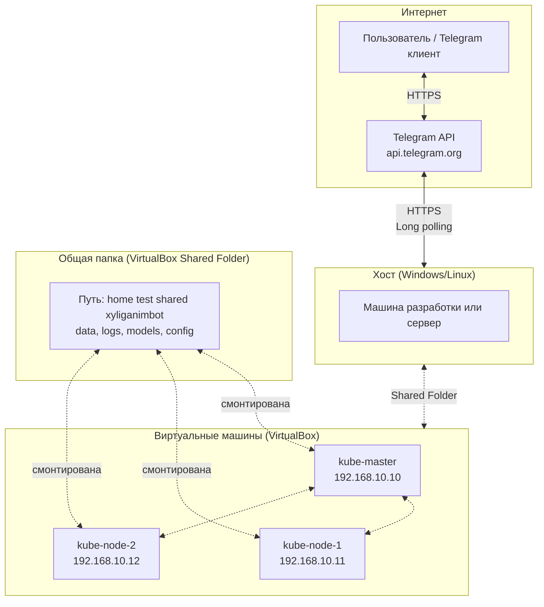
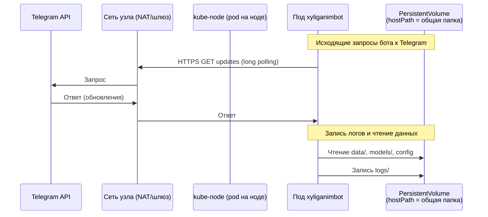
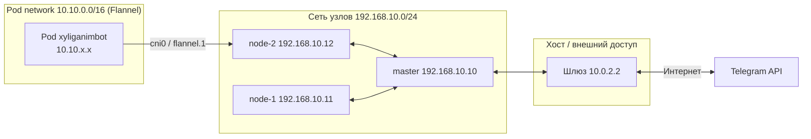
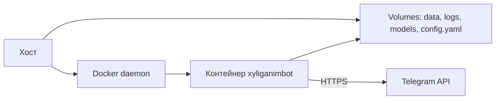

# Сетевая схема: прохождение пакетов

Как трафик проходит между пользователем (Telegram), хостом, виртуалками, Docker/Kubernetes и ботом.

## Контекст: хост, VM, кластер

## Трафик при запуске бота в Kubernetes

## Сети в Kubernetes (Flannel)

- **Узлы** общаются по 192.168.10.x (enp0s8 в примере).
- **Поды** получают IP из подсети 10.10.0.0/16 (CNI Flannel).
- Исходящий трафик из пода к Telegram идёт через сеть узла и шлюз хоста.

## Docker (один контейнер на хосте)

Трафик: контейнер → сеть хоста (bridge/NAT) → интернет → Telegram API.
